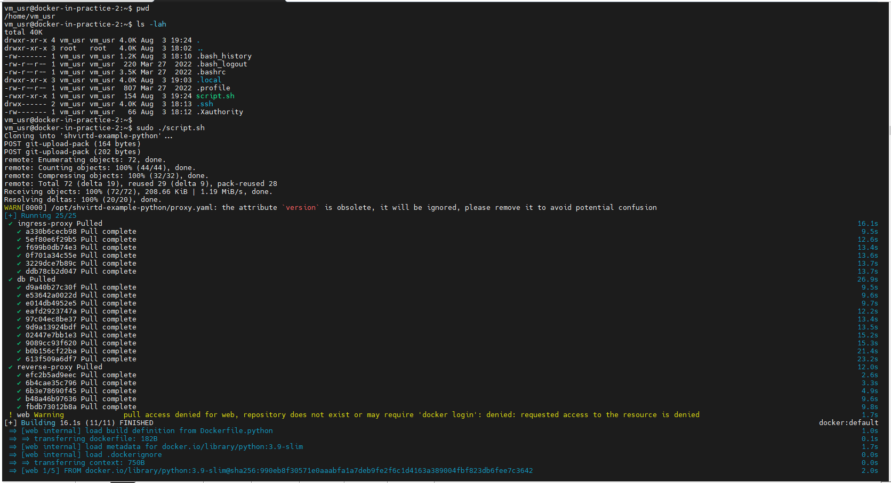
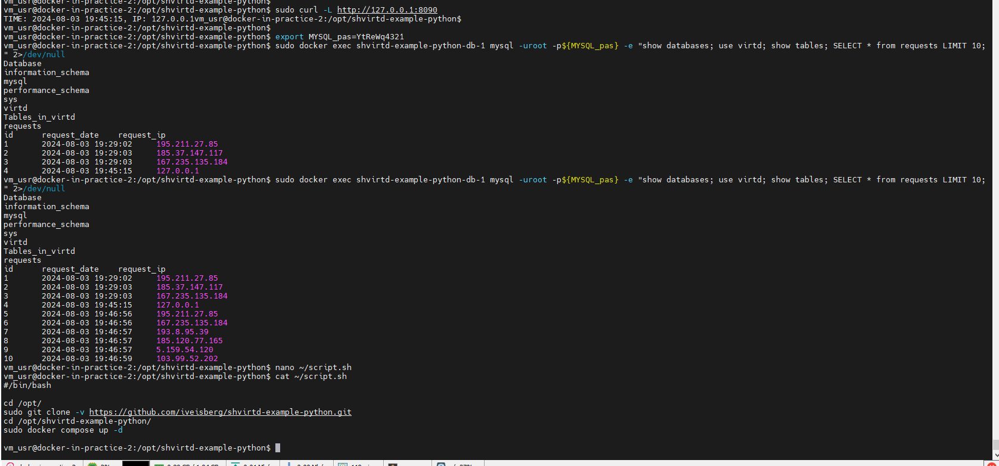

Домашнее задание к занятию 5. «Практическое применение Docker»

## Задача 1

```console
Sat Aug 03 20:51:58 dbn_usr@dbn-net-hw:[~/netology/docker-in-practice/shvirtd-example-python]: docker build -f Dockerfile.python -t web . --no-cache
[+] Building 22.9s (11/11) FINISHED                                                                                                                                                            docker:default
 => [internal] load build definition from Dockerfile.python                                                                                                                                              0.1s
 => => transferring dockerfile: 187B                                                                                                                                                                     0.0s
 => [internal] load metadata for docker.io/library/python:3.9-slim                                                                                                                                       1.9s
 => [auth] library/python:pull token for registry-1.docker.io                                                                                                                                            0.0s
 => [internal] load .dockerignore                                                                                                                                                                        0.1s
 => => transferring context: 790B                                                                                                                                                                        0.0s
 => [1/5] FROM docker.io/library/python:3.9-slim@sha256:990eb8f30571e0aaabfa1a7deb9fe2f6c1d4163a389004fbf823db6fee7c3642                                                                                 0.0s
 => [internal] load build context                                                                                                                                                                        0.1s
 => => transferring context: 64B                                                                                                                                                                         0.0s
 => CACHED [2/5] WORKDIR /app                                                                                                                                                                            0.0s
 => [3/5] COPY requirements.txt ./                                                                                                                                                                       0.6s
 => [4/5] RUN pip install -r requirements.txt                                                                                                                                                           16.1s
 => [5/5] COPY main.py ./                                                                                                                                                                                1.0s
 => exporting to image                                                                                                                                                                                   1.7s
 => => exporting layers                                                                                                                                                                                  1.4s
 => => writing image sha256:7954ea2cc5ba9aa5757e76e001dd99de35c98f2dd0bceb80b8d6e6bf3c0c8ee2                                                                                                             0.0s
 => => naming to docker.io/library/web                                                                                                                                                                   0.1s
Sat Aug 03 20:52:35 dbn_usr@dbn-net-hw:[~/netology/docker-in-practice/shvirtd-example-python]:
Sat Aug 03 20:52:38 dbn_usr@dbn-net-hw:[~/netology/docker-in-practice/shvirtd-example-python]: docker images
REPOSITORY                    TAG       IMAGE ID       CREATED          SIZE
web                           latest    7954ea2cc5ba   11 seconds ago   219MB
Sat Aug 03 20:52:43 dbn_usr@dbn-net-hw:[~/netology/docker-in-practice/shvirtd-example-python]:
Sat Aug 03 20:52:44 dbn_usr@dbn-net-hw:[~/netology/docker-in-practice/shvirtd-example-python]: docker history web
IMAGE          CREATED          CREATED BY                                      SIZE      COMMENT
7954ea2cc5ba   19 seconds ago   CMD ["python" "main.py"]                        0B        buildkit.dockerfile.v0
<missing>      19 seconds ago   COPY main.py ./ # buildkit                      1.36kB    buildkit.dockerfile.v0
<missing>      20 seconds ago   RUN /bin/sh -c pip install -r requirements.t…   94.1MB    buildkit.dockerfile.v0
<missing>      36 seconds ago   COPY requirements.txt ./ # buildkit             31B       buildkit.dockerfile.v0
<missing>      13 minutes ago   WORKDIR /app                                    0B        buildkit.dockerfile.v0
<missing>      5 days ago       CMD ["python3"]                                 0B        buildkit.dockerfile.v0
<missing>      5 days ago       RUN /bin/sh -c set -eux;   savedAptMark="$(a…   10MB      buildkit.dockerfile.v0
<missing>      5 days ago       ENV PYTHON_GET_PIP_SHA256=6fb7b781206356f45a…   0B        buildkit.dockerfile.v0
<missing>      5 days ago       ENV PYTHON_GET_PIP_URL=https://github.com/py…   0B        buildkit.dockerfile.v0
<missing>      5 days ago       ENV PYTHON_SETUPTOOLS_VERSION=58.1.0            0B        buildkit.dockerfile.v0
<missing>      5 days ago       ENV PYTHON_PIP_VERSION=23.0.1                   0B        buildkit.dockerfile.v0
<missing>      5 days ago       RUN /bin/sh -c set -eux;  for src in idle3 p…   32B       buildkit.dockerfile.v0
<missing>      5 days ago       RUN /bin/sh -c set -eux;   savedAptMark="$(a…   31.3MB    buildkit.dockerfile.v0
<missing>      5 days ago       ENV PYTHON_VERSION=3.9.19                       0B        buildkit.dockerfile.v0
<missing>      5 days ago       ENV GPG_KEY=E3FF2839C048B25C084DEBE9B26995E3…   0B        buildkit.dockerfile.v0
<missing>      5 days ago       RUN /bin/sh -c set -eux;  apt-get update;  a…   9.23MB    buildkit.dockerfile.v0
<missing>      5 days ago       ENV LANG=C.UTF-8                                0B        buildkit.dockerfile.v0
<missing>      5 days ago       ENV PATH=/usr/local/bin:/usr/local/sbin:/usr…   0B        buildkit.dockerfile.v0
<missing>      11 days ago      /bin/sh -c #(nop)  CMD ["bash"]                 0B
<missing>      11 days ago      /bin/sh -c #(nop) ADD file:6c4730e7b12278bc7…   74.8MB
Sat Aug 03 20:52:51 dbn_usr@dbn-net-hw:[~/netology/docker-in-practice/shvirtd-example-python]:
```

## Задача 2

```console
Sat Aug 03 20:55:17 dbn_usr@dbn-net-hw:[~]: yc container registry create --name test
done (1s)
id: crpilqlhcn2l16p788kv
folder_id: b1gue9v1tapk50i3uj7m
name: test
status: ACTIVE
created_at: "2024-08-03T13:55:32.148Z"

Sat Aug 03 20:55:34 dbn_usr@dbn-net-hw:[~]:
Sat Aug 03 20:56:06 dbn_usr@dbn-net-hw:[~]: yc container registry list
+----------------------+------+----------------------+
|          ID          | NAME |      FOLDER ID       |
+----------------------+------+----------------------+
| crpilqlhcn2l16p788kv | test | b1gue9v1tapk50i3uj7m |
+----------------------+------+----------------------+

Sat Aug 03 21:06:22 dbn_usr@dbn-net-hw:[~]:
Sat Aug 03 21:06:22 dbn_usr@dbn-net-hw:[~]: docker images|grep web
web                           latest    a3a5c13056e1   About a minute ago   219MB
Sat Aug 03 21:06:25 dbn_usr@dbn-net-hw:[~]:
Sat Aug 03 21:06:26 dbn_usr@dbn-net-hw:[~]: docker tag web cr.yandex/crpilqlhcn2l16p788kv/web:latest
Sat Aug 03 21:07:55 dbn_usr@dbn-net-hw:[~]:
Sat Aug 03 21:07:56 dbn_usr@dbn-net-hw:[~]: docker images|grep web
cr.yandex/crpilqlhcn2l16p788kv/web   latest    a3a5c13056e1   2 minutes ago   219MB
web                                  latest    a3a5c13056e1   2 minutes ago   219MB
Sat Aug 03 21:07:58 dbn_usr@dbn-net-hw:[~]:
Sat Aug 03 21:08:00 dbn_usr@dbn-net-hw:[~]: docker push cr.yandex/crpilqlhcn2l16p788kv/web:latest
The push refers to repository [cr.yandex/crpilqlhcn2l16p788kv/web]
d382a853f00d: Pushed
3d5605919ed2: Pushed
3c50e369a731: Pushed
c2d66e5068a6: Pushed
ec6949936a52: Pushed
f71fab544a97: Pushed
d42276be00b5: Pushed
cc2286334a7b: Pushed
e0781bc8667f: Pushed
latest: digest: sha256:8b38f2543fdd63121802dd2e463cadd29c981f0c8cd0661a5b10c5a4d5afbbca size: 2202
Sat Aug 03 21:11:17 dbn_usr@dbn-net-hw:[~]:
Sat Aug 03 21:11:21 dbn_usr@dbn-net-hw:[~]: yc container image get crpn3cfcajo64v6bj0bq
id: crpn3cfcajo64v6bj0bq
name: crpilqlhcn2l16p788kv/web
digest: sha256:8b38f2543fdd63121802dd2e463cadd29c981f0c8cd0661a5b10c5a4d5afbbca
compressed_size: "90602973"
config:
  id: crpcnuquggoq1bhddnp1
  digest: sha256:a3a5c13056e1dfb4f97ebb82456ce96e1ea6d34a0216dc98679fd052ed49c228
  size: "7926"
layers:
  - id: crpe42nathuu0ejdhhr7
    digest: sha256:efc2b5ad9eec05befa54239d53feeae3569ccbef689aa5e5dbfc25da6c4df559
    size: "29126287"
  - id: crpv5erptmir0ab6g36d
    digest: sha256:c87f9801692e4bdc9e1d19fac4be5f124c44c8aa0f5260209b8c18ee94646224
    size: "3509965"
  - id: crpvd23f5k33at3om99h
    digest: sha256:5ad7287a1ddf6c0381d529d7360e2565d22f02b503acc240ba4e0b4427b6c5be
    size: "11890720"
  - id: crprbvjl0e9rjro8aka2
    digest: sha256:a3d3ef1ae64a2defc21b804c81691d6928880ef0cde0fe750a1f8ce6de87f81b
    size: "233"
  - id: crpjc0enp0g214khjo1l
    digest: sha256:54c8e329ac5ee70923b0299f6432daf03b1ad22ed1c6d77eba8c54b0742f4825
    size: "2772897"
  - id: crpld2vdvv4qa30mqs7m
    digest: sha256:a49be4213205d0a50effc4252a3d2588e9e9d32e17004c38a1d3364daeff2356
    size: "91"
  - id: crpnqdai2i8hi0l4d3hk
    digest: sha256:422c5aec66a0b423af5c9cf4d85ea6662673f619fb9736ce4d40cfef84b18c0a
    size: "175"
  - id: crpknaccffv1mvs1f4tm
    digest: sha256:066c8607794a054d77b1a337ad92877779e459f77dccf96a338dd3e090a1e3e4
    size: "43293749"
  - id: crpsoiinic6upqinjr7v
    digest: sha256:0638c6acaeaf3568ebf14025bcf8c5cd1339e37ffefc497ab953aa5b69b2bfad
    size: "930"
tags:
  - latest
created_at: "2024-08-03T14:08:32.804Z"

Sat Aug 03 21:14:50 dbn_usr@dbn-net-hw:[~]:
```


## Задача 3

```console
Sun Aug 04 00:19:21 dbn_usr@dbn-net-hw:[~/netology/docker-in-practice/shvirtd-example-python]: docker network inspect shvirtd-example-python_backend
[
    {
        "Name": "shvirtd-example-python_backend",
        "Id": "02a3fd5569f98e97c78423a03be223d0c6d9fbe39a5de162883be17206b5ed24",
        "Created": "2024-08-04T00:08:34.193392414+07:00",
        "Scope": "local",
        "Driver": "bridge",
        "EnableIPv6": false,
        "IPAM": {
            "Driver": "default",
            "Options": null,
            "Config": [
                {
                    "Subnet": "172.20.0.0/24"
                }
            ]
        },
        "Internal": false,
        "Attachable": false,
        "Ingress": false,
        "ConfigFrom": {
            "Network": ""
        },
        "ConfigOnly": false,
        "Containers": {
            "38ff2afa2cd2d127cec9670b4f19e11646aa6bf69e82e598188c9a0d4921ef01": {
                "Name": "shvirtd-example-python-db-1",
                "EndpointID": "cb7242dffbdecf07300060adb5d05e18c072437e4becdd050f7ba48f19671281",
                "MacAddress": "02:42:ac:14:00:0a",
                "IPv4Address": "172.20.0.10/24",
                "IPv6Address": ""
            },
            "64f1d7580f8594c28ec742948be2bdc24f776f3cfe63b50cd35c560698aaf747": {
                "Name": "shvirtd-example-python-reverse-proxy-1",
                "EndpointID": "85295cef274b5f5202c40c66bf34c97db831a3fda243445b18d6c2d5fa7ff36a",
                "MacAddress": "02:42:ac:14:00:02",
                "IPv4Address": "172.20.0.2/24",
                "IPv6Address": ""
            },
            "be028235d969b65f8a94eecfe50435ef118110b5bb2a8ce94941994befde9c68": {
                "Name": "shvirtd-example-python-web-1",
                "EndpointID": "f451eb0a3e41534dec69e6854bd65779e7deee46d00e0c15f8198ee70d0d8e42",
                "MacAddress": "02:42:ac:14:00:05",
                "IPv4Address": "172.20.0.5/24",
                "IPv6Address": ""
            }
        },
        "Options": {},
        "Labels": {
            "com.docker.compose.network": "backend",
            "com.docker.compose.project": "shvirtd-example-python",
            "com.docker.compose.version": "2.29.1"
        }
    }
]
Sun Aug 04 00:20:00 dbn_usr@dbn-net-hw:[~/netology/docker-in-practice/shvirtd-example-python]:
Sun Aug 04 00:10:58 dbn_usr@dbn-net-hw:[~/netology/docker-in-practice/shvirtd-example-python]: curl -L http://127.0.0.1:8090
TIME: 2024-08-03 17:10:59, IP: 127.0.0.1Sun Aug 04 00:10:59 dbn_usr@dbn-net-hw:[~/netology/docker-in-practice/shvirtd-example-python]:
Sun Aug 04 00:10:59 dbn_usr@dbn-net-hw:[~/netology/docker-in-practice/shvirtd-example-python]:
Sun Aug 04 00:11:00 dbn_usr@dbn-net-hw:[~/netology/docker-in-practice/shvirtd-example-python]: export MYSQL_pas=YtReWq4321
Sun Aug 04 00:11:45 dbn_usr@dbn-net-hw:[~/netology/docker-in-practice/shvirtd-example-python]: docker exec shvirtd-example-python-db-1 mysql -uroot -p${MYSQL_pas} -e "show databases; use virtd; show tables; SELECT * from requests LIMIT 10;" 2>/dev/null
Database
information_schema
mysql
performance_schema
sys
virtd
Tables_in_virtd
requests
id      request_date    request_ip
1       2024-08-01 16:22:58     127.0.0.1
2       2024-08-01 16:23:18     NULL
3       2024-08-01 16:23:26     127.0.0.1
4       2024-08-01 16:23:38     127.0.0.1
5       2024-08-01 16:28:08     127.0.0.1
6       2024-08-01 16:28:41     127.0.0.1
7       2024-08-01 16:31:19     127.0.0.1
8       2024-08-01 16:45:11     127.0.0.1
9       2024-08-01 16:52:23     127.0.0.1
10      2024-08-01 16:52:25     127.0.0.1
Sun Aug 04 00:11:58 dbn_usr@dbn-net-hw:[~/netology/docker-in-practice/shvirtd-example-python]:
Sun Aug 04 00:11:58 dbn_usr@dbn-net-hw:[~/netology/docker-in-practice/shvirtd-example-python]: docker exec -it shvirtd-example-python-db-1 bash
bash-5.1# mysql -uroot -pYtReWq4321
mysql: [Warning] Using a password on the command line interface can be insecure.
Welcome to the MySQL monitor.  Commands end with ; or \g.
Your MySQL connection id is 45
Server version: 8.4.2 MySQL Community Server - GPL

Copyright (c) 2000, 2024, Oracle and/or its affiliates.

Oracle is a registered trademark of Oracle Corporation and/or its
affiliates. Other names may be trademarks of their respective
owners.

Type 'help;' or '\h' for help. Type '\c' to clear the current input statement.

mysql> show databases; use virtd; show tables; SELECT * from requests LIMIT 10;
+--------------------+
| Database           |
+--------------------+
| information_schema |
| mysql              |
| performance_schema |
| sys                |
| virtd              |
+--------------------+
5 rows in set (0.01 sec)

Reading table information for completion of table and column names
You can turn off this feature to get a quicker startup with -A

Database changed
+-----------------+
| Tables_in_virtd |
+-----------------+
| requests        |
+-----------------+
1 row in set (0.01 sec)

+----+---------------------+------------+
| id | request_date        | request_ip |
+----+---------------------+------------+
|  1 | 2024-08-01 16:22:58 | 127.0.0.1  |
|  2 | 2024-08-01 16:23:18 | NULL       |
|  3 | 2024-08-01 16:23:26 | 127.0.0.1  |
|  4 | 2024-08-01 16:23:38 | 127.0.0.1  |
|  5 | 2024-08-01 16:28:08 | 127.0.0.1  |
|  6 | 2024-08-01 16:28:41 | 127.0.0.1  |
|  7 | 2024-08-01 16:31:19 | 127.0.0.1  |
|  8 | 2024-08-01 16:45:11 | 127.0.0.1  |
|  9 | 2024-08-01 16:52:23 | 127.0.0.1  |
| 10 | 2024-08-01 16:52:25 | 127.0.0.1  |
+----+---------------------+------------+
10 rows in set (0.00 sec)

mysql>
```


## Задача 4

```console
vm_usr@docker-in-practice-2:~$ pwd
/home/vm_usr
vm_usr@docker-in-practice-2:~$ ls -lah
total 40K
drwxr-xr-x 4 vm_usr vm_usr 4.0K Aug  3 19:24 .
drwxr-xr-x 3 root   root   4.0K Aug  3 18:02 ..
-rw------- 1 vm_usr vm_usr 1.2K Aug  3 18:10 .bash_history
-rw-r--r-- 1 vm_usr vm_usr  220 Mar 27  2022 .bash_logout
-rw-r--r-- 1 vm_usr vm_usr 3.5K Mar 27  2022 .bashrc
drwxr-xr-x 3 vm_usr vm_usr 4.0K Aug  3 19:03 .local
-rw-r--r-- 1 vm_usr vm_usr  807 Mar 27  2022 .profile
-rwxr-xr-x 1 vm_usr vm_usr  154 Aug  3 19:24 script.sh
drwx------ 2 vm_usr vm_usr 4.0K Aug  3 18:13 .ssh
-rw------- 1 vm_usr vm_usr   66 Aug  3 18:12 .Xauthority
vm_usr@docker-in-practice-2:~$
vm_usr@docker-in-practice-2:~$ sudo ./script.sh
Cloning into 'shvirtd-example-python'...
POST git-upload-pack (164 bytes)
POST git-upload-pack (202 bytes)
remote: Enumerating objects: 72, done.
remote: Counting objects: 100% (44/44), done.
remote: Compressing objects: 100% (32/32), done.
remote: Total 72 (delta 19), reused 29 (delta 9), pack-reused 28
Receiving objects: 100% (72/72), 208.66 KiB | 1.19 MiB/s, done.
Resolving deltas: 100% (20/20), done.
WARN[0000] /opt/shvirtd-example-python/proxy.yaml: the attribute `version` is obsolete, it will be ignored, please remove it to avoid potential confusion
[+] Running 25/25
 ✔ ingress-proxy Pulled                                                                                                                                                                                 16.1s
   ✔ a330b6cecb98 Pull complete                                                                                                                                                                          9.5s
   ✔ 5ef80e6f29b5 Pull complete                                                                                                                                                                         12.6s
   ✔ f699b0db74e3 Pull complete                                                                                                                                                                         13.4s
   ✔ 0f701a34c55e Pull complete                                                                                                                                                                         13.6s
   ✔ 3229dce7b89c Pull complete                                                                                                                                                                         13.7s
   ✔ ddb78cb2d047 Pull complete                                                                                                                                                                         13.7s
 ✔ db Pulled                                                                                                                                                                                            26.9s
   ✔ d9a40b27c30f Pull complete                                                                                                                                                                          9.5s
   ✔ e53642a0022d Pull complete                                                                                                                                                                          9.6s
   ✔ e014db4952e5 Pull complete                                                                                                                                                                          9.7s
   ✔ eafd2923747a Pull complete                                                                                                                                                                         12.2s
   ✔ 97c04ec8be37 Pull complete                                                                                                                                                                         13.4s
   ✔ 9d9a13924bdf Pull complete                                                                                                                                                                         13.5s
   ✔ 02447e7bb1e3 Pull complete                                                                                                                                                                         15.2s
   ✔ 9089cc93f620 Pull complete                                                                                                                                                                         15.3s
   ✔ b0b156cf22ba Pull complete                                                                                                                                                                         21.4s
   ✔ 613f509a6df7 Pull complete                                                                                                                                                                         23.2s
 ✔ reverse-proxy Pulled                                                                                                                                                                                 12.0s
   ✔ efc2b5ad9eec Pull complete                                                                                                                                                                          2.6s
   ✔ 6b4cae35c796 Pull complete                                                                                                                                                                          3.3s
   ✔ 6b3e78690f45 Pull complete                                                                                                                                                                          4.9s
   ✔ b48a46b97636 Pull complete                                                                                                                                                                          9.6s
   ✔ fbdb73012b8a Pull complete                                                                                                                                                                          9.8s
 ! web Warning              pull access denied for web, repository does not exist or may require 'docker login': denied: requested access to the resource is denied                                      1.7s
[+] Building 16.1s (11/11) FINISHED                                                                                                                                                            docker:default
 => [web internal] load build definition from Dockerfile.python                                                                                                                                          1.0s
 => => transferring dockerfile: 182B                                                                                                                                                                     0.1s
 => [web internal] load metadata for docker.io/library/python:3.9-slim                                                                                                                                   1.7s
 => [web internal] load .dockerignore                                                                                                                                                                    0.0s
 => => transferring context: 750B                                                                                                                                                                        0.0s
 => [web 1/5] FROM docker.io/library/python:3.9-slim@sha256:990eb8f30571e0aaabfa1a7deb9fe2f6c1d4163a389004fbf823db6fee7c3642                                                                             2.0s
 => => resolve docker.io/library/python:3.9-slim@sha256:990eb8f30571e0aaabfa1a7deb9fe2f6c1d4163a389004fbf823db6fee7c3642                                                                                 0.1s
 => => sha256:c87f9801692e4bdc9e1d19fac4be5f124c44c8aa0f5260209b8c18ee94646224 3.51MB / 3.51MB                                                                                                           0.2s
 => => sha256:5ad7287a1ddf6c0381d529d7360e2565d22f02b503acc240ba4e0b4427b6c5be 11.89MB / 11.89MB                                                                                                         0.5s
 => => sha256:a3d3ef1ae64a2defc21b804c81691d6928880ef0cde0fe750a1f8ce6de87f81b 233B / 233B                                                                                                               0.5s
 => => sha256:990eb8f30571e0aaabfa1a7deb9fe2f6c1d4163a389004fbf823db6fee7c3642 10.41kB / 10.41kB                                                                                                         0.0s
 => => sha256:d433bca818eca04fef21ac9e5e2bff7226169ad1cb4ae5380892205e1286defc 1.94kB / 1.94kB                                                                                                           0.0s
 => => sha256:c21985b6cbb254ab1c851bfcfd40a34e84205ec572f5a418376d1613f2b1255f 6.90kB / 6.90kB                                                                                                           0.0s
 => => extracting sha256:c87f9801692e4bdc9e1d19fac4be5f124c44c8aa0f5260209b8c18ee94646224                                                                                                                0.2s
 => => sha256:54c8e329ac5ee70923b0299f6432daf03b1ad22ed1c6d77eba8c54b0742f4825 2.77MB / 2.77MB                                                                                                           0.7s
 => => extracting sha256:5ad7287a1ddf6c0381d529d7360e2565d22f02b503acc240ba4e0b4427b6c5be                                                                                                                0.5s
 => => extracting sha256:a3d3ef1ae64a2defc21b804c81691d6928880ef0cde0fe750a1f8ce6de87f81b                                                                                                                0.0s
 => => extracting sha256:54c8e329ac5ee70923b0299f6432daf03b1ad22ed1c6d77eba8c54b0742f4825                                                                                                                0.2s
 => [web internal] load build context                                                                                                                                                                    0.1s
 => => transferring context: 1.43kB                                                                                                                                                                      0.0s
 => [web 2/5] WORKDIR /app                                                                                                                                                                               1.2s
 => [web 3/5] COPY requirements.txt ./                                                                                                                                                                   0.2s
 => [web 4/5] RUN pip install -r requirements.txt                                                                                                                                                        8.7s
 => [web 5/5] COPY main.py ./                                                                                                                                                                            0.4s
 => [web] exporting to image                                                                                                                                                                             0.5s
 => => exporting layers                                                                                                                                                                                  0.5s
 => => writing image sha256:50f1cccc2630c2ce3daef8b47e85fcf4bcb59d9f998c9ae3534d8ddc3b5ebe86                                                                                                             0.0s
 => => naming to docker.io/library/web:latest                                                                                                                                                            0.0s
 => [web] resolving provenance for metadata file                                                                                                                                                         0.0s
[+] Running 7/7
 ✔ Network shvirtd-example-python_backend            Created                                                                                                                                             0.1s
 ✔ Volume "shvirtd-example-python_db_data"           Created                                                                                                                                             0.0s
 ✔ Volume "shvirtd-example-python_web_data"          Created                                                                                                                                             0.0s
 ✔ Container shvirtd-example-python-reverse-proxy-1  Started                                                                                                                                             3.2s
 ✔ Container shvirtd-example-python-db-1             Healthy                                                                                                                                            44.2s
 ✔ Container shvirtd-example-python-ingress-proxy-1  Started                                                                                                                                             2.9s
 ✔ Container shvirtd-example-python-web-1            Started                                                                                                                                            45.4s
vm_usr@docker-in-practice-2:~$
vm_usr@docker-in-practice-2:~$ sudo docker ps -a
CONTAINER ID   IMAGE          COMMAND                  CREATED              STATUS                        PORTS                                 NAMES
fc850377e060   web:latest     "python main.py"         About a minute ago   Up About a minute             127.0.0.1:5000->8000/tcp              shvirtd-example-python-web-1
bd4205c2e773   haproxy:2.4    "docker-entrypoint.s…"   About a minute ago   Up About a minute             127.0.0.1:8080->8080/tcp              shvirtd-example-python-reverse-proxy-1
121dd452ae64   nginx:1.21.1   "/docker-entrypoint.…"   About a minute ago   Up About a minute                                                   shvirtd-example-python-ingress-proxy-1
fec3fdd0c44f   mysql:8        "docker-entrypoint.s…"   About a minute ago   Up About a minute (healthy)   127.0.0.1:3306->3306/tcp, 33060/tcp   shvirtd-example-python-db-1
vm_usr@docker-in-practice-2:~$
vm_usr@docker-in-practice-2:/opt/shvirtd-example-python$ sudo curl -L http://127.0.0.1:8090
TIME: 2024-08-03 19:45:15, IP: 127.0.0.1vm_usr@docker-in-practice-2:/opt/shvirtd-example-python$
vm_usr@docker-in-practice-2:/opt/shvirtd-example-python$
vm_usr@docker-in-practice-2:/opt/shvirtd-example-python$ export MYSQL_pas=YtReWq4321
vm_usr@docker-in-practice-2:/opt/shvirtd-example-python$ sudo docker exec shvirtd-example-python-db-1 mysql -uroot -p${MYSQL_pas} -e "show databases; use virtd; show tables; SELECT * from requests LIMIT 10;" 2>/dev/null
Database
information_schema
mysql
performance_schema
sys
virtd
Tables_in_virtd
requests
id      request_date    request_ip
1       2024-08-03 19:29:02     195.211.27.85
2       2024-08-03 19:29:03     185.37.147.117
3       2024-08-03 19:29:03     167.235.135.184
4       2024-08-03 19:45:15     127.0.0.1
vm_usr@docker-in-practice-2:/opt/shvirtd-example-python$ sudo docker exec shvirtd-example-python-db-1 mysql -uroot -p${MYSQL_pas} -e "show databases; use virtd; show tables; SELECT * from requests LIMIT 10;" 2>/dev/null
Database
information_schema
mysql
performance_schema
sys
virtd
Tables_in_virtd
requests
id      request_date    request_ip
1       2024-08-03 19:29:02     195.211.27.85
2       2024-08-03 19:29:03     185.37.147.117
3       2024-08-03 19:29:03     167.235.135.184
4       2024-08-03 19:45:15     127.0.0.1
5       2024-08-03 19:46:56     195.211.27.85
6       2024-08-03 19:46:56     167.235.135.184
7       2024-08-03 19:46:57     193.8.95.39
8       2024-08-03 19:46:57     185.120.77.165
9       2024-08-03 19:46:57     5.159.54.120
10      2024-08-03 19:46:59     103.99.52.202
vm_usr@docker-in-practice-2:/opt/shvirtd-example-python$ cat ~/script.sh
#/bin/bash

cd /opt/
sudo git clone -v https://github.com/iveisberg/shvirtd-example-python.git
cd /opt/shvirtd-example-python/
sudo docker compose up -d

vm_usr@docker-in-practice-2:/opt/shvirtd-example-python$
```

https://github.com/iveisberg/shvirtd-example-python/tree/main






```console
Sun Aug 04 16:01:14 dbn_usr@dbn-net-hw:[~]: ssh vm_usr@89.169.137.69 sudo docker ps -a
CONTAINER ID   IMAGE          COMMAND                  CREATED        STATUS                    PORTS                                 NAMES
d3c4daca0449   web:latest     "python main.py"         13 hours ago   Up 16 minutes             127.0.0.1:5000->8000/tcp              shvirtd-example-python-web-1
32b228cd930e   haproxy:2.4    "docker-entrypoint.s…"   13 hours ago   Up 17 minutes             127.0.0.1:8080->8080/tcp              shvirtd-example-python-reverse-proxy-1
9015c5de127b   mysql:8        "docker-entrypoint.s…"   13 hours ago   Up 17 minutes (healthy)   127.0.0.1:3306->3306/tcp, 33060/tcp   shvirtd-example-python-db-1
1350ba9b9f17   nginx:1.21.1   "/docker-entrypoint.…"   13 hours ago   Up 17 minutes                                                   shvirtd-example-python-ingress-proxy-1
Sun Aug 04 16:01:23 dbn_usr@dbn-net-hw:[~]:
```

## Задача 5

Пытался долго и много, но так и не смог разрбраться, все время ошибки типа:

```console
mysqldump: Got error: 1045: "Plugin sha256_password could not be loaded: Error loading shared library /usr/lib/mariadb/plugin/sha256_password.so: No such file or directory" when trying to connect
```
Возникает либо ошибка выше, либо ее нет, но файл РК все равно остается пустым.

## Задача 6

```console
td-example-python]: docker image save -o /tmp/image.tar.gz hashicorp/terraform
Sun Aug 04 22:41:47 dbn_usr@dbn-net-hw:[~/netology/docker-in-practice/shvirtd-example-python]: cd /tmp/
Sun Aug 04 22:41:53 dbn_usr@dbn-net-hw:[/tmp]: ls -alh
total 111M
drwxrwxrwt 10 root    root    4.0K Aug  4 22:41 .
drwxr-xr-x 18 root    root    4.0K Jul 23 17:26 ..
drwxrwxrwt  2 root    root    4.0K Aug  4 15:34 .font-unix
drwxrwxrwt  2 root    root    4.0K Aug  4 15:34 .ICE-unix
-rw-------  1 dbn_usr dbn_usr 111M Aug  4 22:41 image.tar.gz
drwx------  2 dbn_usr dbn_usr 4.0K Aug  4 19:05 mc-dbn_usr
drwx------  3 root    root    4.0K Aug  4 15:34 systemd-private-4d801f3dc5544e4a907d6cd4de6c9cd7-apache2.service-Xz7CEa
drwx------  3 root    root    4.0K Aug  4 15:34 systemd-private-4d801f3dc5544e4a907d6cd4de6c9cd7-systemd-logind.service-XQVz98
drwx------  3 root    root    4.0K Aug  4 15:34 systemd-private-4d801f3dc5544e4a907d6cd4de6c9cd7-systemd-timesyncd.service-Y53zfR
drwxrwxrwt  2 root    root    4.0K Aug  4 15:34 .X11-unix
drwxrwxrwt  2 root    root    4.0K Aug  4 15:34 .XIM-unix
Sun Aug 04 22:41:56 dbn_usr@dbn-net-hw:[/tmp]: tar xvf /tmp/image.tar.gz
blobs/
blobs/sha256/
blobs/sha256/1b0aeb90d6d084d1f38829d43cc8cd4bca300bce0a055074f2774d9ba6189f35
blobs/sha256/6667dc5a1db42b3fc4bb7a373d467f735470f8cadf4765721b5411cfaf00f9d2
blobs/sha256/6a8b58da9bb9b21b37fd17b9d461619519385d02b2981240c76284f7d55c22c0
blobs/sha256/78561cef0761903dd2f7d09856150a6d4fb48967a8f113f3e33d79effbf59a07
blobs/sha256/860d5a4edab97b39e6dcc6801dc2419b0eaae67bd534a81fda7c97ed9f29e4c9
blobs/sha256/8fdc1aee4e5ba5bb6d7626098db1a8231e29d578009075ee95a9b3e9f0fea4b0
blobs/sha256/c0922976361f945bcf88a9e8e5e65bde4218acccc0ed96e791155e221032231d
blobs/sha256/c445e13d97d526c8cc7c76832adc5f44fab1400f485ccdd7805a7fbfbc324981
blobs/sha256/dd449816f8c3343e5bd9b7dc147c0cfb148b51ae1102dfffa73b804b8d5d8bff
blobs/sha256/f52ae49d6b354b2b9c7b7133e77ee5755a9df368a3df4afd3e628ddedaf717f2
index.json
manifest.json
oci-layout
repositories
Sun Aug 04 22:42:32 dbn_usr@dbn-net-hw:[/tmp]:
Sun Aug 04 22:42:34 dbn_usr@dbn-net-hw:[/tmp]: ls -alh
total 111M
drwxrwxrwt 11 root    root    4.0K Aug  4 22:42 .
drwxr-xr-x 18 root    root    4.0K Jul 23 17:26 ..
drwxr-xr-x  3 dbn_usr dbn_usr 4.0K Jul 25 01:02 blobs
drwxrwxrwt  2 root    root    4.0K Aug  4 15:34 .font-unix
drwxrwxrwt  2 root    root    4.0K Aug  4 15:34 .ICE-unix
-rw-------  1 dbn_usr dbn_usr 111M Aug  4 22:41 image.tar.gz
-rw-r--r--  1 dbn_usr dbn_usr  367 Aug  4 22:41 index.json
-rw-r--r--  1 dbn_usr dbn_usr 1.4K Jan  1  1970 manifest.json
drwx------  2 dbn_usr dbn_usr 4.0K Aug  4 19:05 mc-dbn_usr
-rw-r--r--  1 dbn_usr dbn_usr   31 Jan  1  1970 oci-layout
-rw-r--r--  1 dbn_usr dbn_usr  102 Jan  1  1970 repositories
drwx------  3 root    root    4.0K Aug  4 15:34 systemd-private-4d801f3dc5544e4a907d6cd4de6c9cd7-apache2.service-Xz7CEa
drwx------  3 root    root    4.0K Aug  4 15:34 systemd-private-4d801f3dc5544e4a907d6cd4de6c9cd7-systemd-logind.service-XQVz98
drwx------  3 root    root    4.0K Aug  4 15:34 systemd-private-4d801f3dc5544e4a907d6cd4de6c9cd7-systemd-timesyncd.service-Y53zfR
drwxrwxrwt  2 root    root    4.0K Aug  4 15:34 .X11-unix
drwxrwxrwt  2 root    root    4.0K Aug  4 15:34 .XIM-unix
Sun Aug 04 22:42:35 dbn_usr@dbn-net-hw:[/tmp]: dive hashicorp/terraform
Image Source: docker://hashicorp/terraform
Fetching image... (this can take a while for large images)
Analyzing image...
Building cache...
Sun Aug 04 22:43:20 dbn_usr@dbn-net-hw:[/tmp]: ls -alh blobs/
total 12K
drwxr-xr-x  3 dbn_usr dbn_usr 4.0K Jul 25 01:02 .
drwxrwxrwt 11 root    root    4.0K Aug  4 22:43 ..
drwxr-xr-x  2 dbn_usr dbn_usr 4.0K Aug  4 22:41 sha256
Sun Aug 04 22:43:57 dbn_usr@dbn-net-hw:[/tmp]: ls -alh blobs/sha256/
total 111M
drwxr-xr-x 2 dbn_usr dbn_usr 4.0K Aug  4 22:41 .
drwxr-xr-x 3 dbn_usr dbn_usr 4.0K Jul 25 01:02 ..
-rw-r--r-- 1 dbn_usr dbn_usr 1.7K Jul 25 01:02 1b0aeb90d6d084d1f38829d43cc8cd4bca300bce0a055074f2774d9ba6189f35
-rw-r--r-- 1 dbn_usr dbn_usr 8.5K Jul 25 01:02 6667dc5a1db42b3fc4bb7a373d467f735470f8cadf4765721b5411cfaf00f9d2
-rw-r--r-- 1 dbn_usr dbn_usr  406 Jul 25 01:02 6a8b58da9bb9b21b37fd17b9d461619519385d02b2981240c76284f7d55c22c0
-rw-r--r-- 1 dbn_usr dbn_usr 7.8M Jul 25 01:02 78561cef0761903dd2f7d09856150a6d4fb48967a8f113f3e33d79effbf59a07
-rw-r--r-- 1 dbn_usr dbn_usr  482 Jul 25 01:02 860d5a4edab97b39e6dcc6801dc2419b0eaae67bd534a81fda7c97ed9f29e4c9
-rw-r--r-- 1 dbn_usr dbn_usr  482 Jul 25 01:02 8fdc1aee4e5ba5bb6d7626098db1a8231e29d578009075ee95a9b3e9f0fea4b0
-rw-r--r-- 1 dbn_usr dbn_usr  18M Jul 25 01:02 c0922976361f945bcf88a9e8e5e65bde4218acccc0ed96e791155e221032231d
-rw-r--r-- 1 dbn_usr dbn_usr  859 Jan  1  1970 c445e13d97d526c8cc7c76832adc5f44fab1400f485ccdd7805a7fbfbc324981
-rw-r--r-- 1 dbn_usr dbn_usr  85M Jul 25 01:02 dd449816f8c3343e5bd9b7dc147c0cfb148b51ae1102dfffa73b804b8d5d8bff
-rw-r--r-- 1 dbn_usr dbn_usr 4.2K Jul 25 01:02 f52ae49d6b354b2b9c7b7133e77ee5755a9df368a3df4afd3e628ddedaf717f2
Sun Aug 04 22:44:01 dbn_usr@dbn-net-hw:[/tmp]: cd blobs/sha256/
Sun Aug 04 22:44:25 dbn_usr@dbn-net-hw:[/tmp/blobs/sha256]: tar xvf dd449816f8c3343e5bd9b7dc147c0cfb148b51ae1102dfffa73b804b8d5d8bff
bin/
bin/terraform
Sun Aug 04 22:44:36 dbn_usr@dbn-net-hw:[/tmp/blobs/sha256]: ls -lah bin/
total 85M
drwxr-xr-x 2 dbn_usr dbn_usr 4.0K Jul 25 01:02 .
drwxr-xr-x 3 dbn_usr dbn_usr 4.0K Aug  4 22:44 ..
-rwxr-xr-x 1 dbn_usr dbn_usr  85M Jul 25 00:58 terraform
Sun Aug 04 22:44:52 dbn_usr@dbn-net-hw:[/tmp/blobs/sha256]: ls -lah bin/terraform
-rwxr-xr-x 1 dbn_usr dbn_usr 85M Jul 25 00:58 bin/terraform
Sun Aug 04 22:44:55 dbn_usr@dbn-net-hw:[/tmp/blobs/sha256]:
```


```console
Sun Aug 04 23:10:43 dbn_usr@dbn-net-hw:[~]: docker run -d hashicorp/terraform
910997eeb44a72d1b10c30744395e2f63201b9abcb18d96e11bec6ba0a88ce48
Sun Aug 04 23:10:58 dbn_usr@dbn-net-hw:[~]:
Sun Aug 04 23:10:59 dbn_usr@dbn-net-hw:[~]: docker ps -a
CONTAINER ID   IMAGE                           COMMAND                  CREATED         STATUS                       PORTS                                 NAMES
910997eeb44a   hashicorp/terraform             "/bin/terraform"         4 seconds ago   Exited (127) 2 seconds ago                                         nostalgic_borg
Sun Aug 04 23:11:00 dbn_usr@dbn-net-hw:[~]:
Sun Aug 04 23:11:05 dbn_usr@dbn-net-hw:[~]: docker cp nostalgic_borg:/bin/terraform /tmp/
Successfully copied 89MB to /tmp/
Sun Aug 04 23:11:33 dbn_usr@dbn-net-hw:[~]: ls -alh /tmp/
total 196M
drwxrwxrwt 11 root    root    4.0K Aug  4 23:11 .
drwxr-xr-x 18 root    root    4.0K Jul 23 17:26 ..
-rwxr-xr-x  1 dbn_usr dbn_usr  85M Jul 25 00:58 terraform
Sun Aug 04 23:11:39 dbn_usr@dbn-net-hw:[~]:
```


